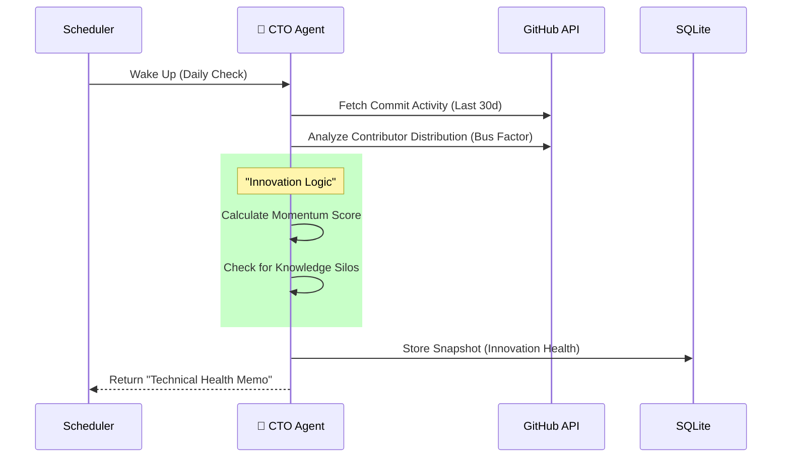

# CTO Agent: Technical Innovation & Health Intelligence

> **"The CTO"**
> An autonomous agent responsible for auditing the engineering heartbeat of the company. It answers the question: *"Is this company technically innovating or stagnating?"*

---

## 1. Core Philosophy (CTO Mindset)
A real CTO evaluates a company by looking at its **Engineering Velocity** and **Technical Debt Signals**.
*   **Not**: "Do they have a GitHub?"
*   **But**: "Is the commit velocity accelerating? Are they shipping new experimental repos? Is the 'Bus Factor' risky?"

## 2. Architecture (3-Tier)

### Tier 1: Data Collection (The Sensors)
*   **`backend/data_sources/github_scraper.py`**:
    *   **Source**: GitHub Public API (Target: `couchbase` org).
    *   **Metrics**:
        *   Commit Velocity (Last 30 days vs Prev 30).
        *   Issue Closure Rate (Bug fix velocity).
        *   New Repository Creation (R&D signal).
*   **`backend/data_sources/tech_blog_scraper.py`**:
    *   **Source**: Official Engineering Blog.
    *   **Metrics**: Frequency of "Deep Tech" posts (Signal of engineering culture).

### Tier 2: The "CTO Brain" (Intelligence)
*   **`backend/agents/cto/agent.py`**:
    *   **Logic Model**: "Innovation Index".
    *   **Decision Rules**:
        *   *Stagnant*: Commits ↓ 20% AND No new repos in 90 days.
        *   *Maintenance Mode*: High Issue closure, Low new feature commits.
        *   *Hyper-Growth*: Commits ↑ 30% AND "AI/Vector" keywords in new repos.
    *   **Risk Analysis (The Elite Metric)**: 
        *   **Bus Factor**: Detects if high output depends on < 3 engineers. 
        *   *Signal*: `bus_factor_risk = True` -> Warning "Fragile Velocity".

### Tier 3: Storage (Memory)
*   **Table: `cto_snapshots`**:
    *   `innovation_score` (0-10)
    *   `execution_health` (Strong | Stable | Declining)

---

## 3. End-to-End Workflow (Implemented)

## 4. Why This Matters
Financials (CFO) lag by 90 days. Narrative (CEO) can be spun. **Code doesn't lie.**
*   If engineering stops shipping 3 months before earnings miss, the CTO Agent will catch it first.
