# 🧠 Auto-Diligence: The Autonomous Executive Suite

> **"Wall Street Intelligence in a Box"**
> An autonomous multi-agent system that audits companies like a Forensic Accountant and strategizes like a Fortune 500 CEO.

[](https://opensource.org/licenses/MIT)


---

## 🚨 The The Problem: "Diligence is Broken"
In today's market, "Truth" is fragmented.
*   **Narrative vs. Reality Gap**: Executives say "We are investing for growth" (Press Releases), but silently freeze hiring (Careers Page).
*   **Information Overload**: No human can read every news article and cross-reference it with scraping data daily.
*   **Latency**: Quarterly earnings calls happen every 90 days. **Strategy breaks weeks before the numbers do.**

## ⚡ The Solution: Autonomous Executive Agents
We don't build "chatbots". We build **Job-Specific Agents** that live on the internet, wake up autonomously, and perform rigorous professional work.

| Agent | Role | Source of Truth | Core Question |
| :--- | :--- | :--- | :--- |
| **🕵️‍♂️ CFO Agent** | **Forensic Auditor** | **Hiring Data (Greenhouse API)** | "Is the company cutting costs while claiming growth?" |
| **♟️ CEO Agent** | **Strategic Sentinel** | **Google News (RSS)** | "Is the strategic narrative becoming defensive or confident?" |

---

## 🏗️ System Architecture (End-to-End)

This system follows a strict **3-Tier Agentic Architecture** to ensure reliability, auditability, and scalability.

```mermaid
graph TD
    subgraph "Tier 1: Data Collection & Resiliency"
        Internet((Internet))
        Greenhouse[Greenhouse API]
        GNews[Google News RSS]
        Scraper1[Careers Scraper]
        Scraper2[News Scraper]
        
        Internet --> Greenhouse
        Internet --> GNews
        Greenhouse --> Scraper1
        GNews --> Scraper2
    end

    subgraph "Tier 2: Intelligence Layer (The Brain)"
        CFO[👮 CFO Agent]
        CEO[🧠 CEO Agent]
        
        Scraper1 -->|Job Titles & Seniority| CFO
        Scraper2 -->|Headlines & Summaries| CEO
        
        Logic1{Forensic Logic}
        Logic2{Time-Based Reasoning}
        
        CFO --> Logic1
        CEO --> Logic2
    end

    subgraph "Tier 3: Storage & Memory"
        DB[(SQLite Database)]
        Snapshot1[CFO Snapshots]
        Snapshot2[CEO Snapshots]
        
        Logic1 -->|Audit Verdict| DB
        Logic2 -->|Narrative Health| DB
        DB --> Snapshot1
        DB --> Snapshot2
    end

    subgraph "Tier 4: Actionable Output"
        Memo[📄 CFO Output: Forensic Memo]
        Dashboard[📊 CEO Output: Strategy Report]
        
        Snapshot1 --> Memo
        Snapshot2 --> Dashboard
    end
    
    style CFO fill:#ff9999,stroke:#333,stroke-width:2px
    style CEO fill:#99ccff,stroke:#333,stroke-width:2px
    style DB fill:#eee,stroke:#333,stroke-width:2px
```



### 🧠 How It Works (The "Brain" Logic)

#### 1. The CFO Agent (Forensic Audit)
It doesn't just count jobs. It looks for **"Narrative Disconnects"**:
*   *IF* Management says "Growth" (Linguistic Analysis > 7/10)
*   *AND* Technical Hiring is dropping (-15% MoM)
*   *THEN* **FLAG**: "Juniorization" or "Deceptive Narrative".

#### 2. The CEO Agent (Strategic Health)
It uses **Time-Based Reasoning**:
*   It remembers the past (SQLite History).
*   It detects *changes* in tone. (e.g., "Defensive language increased 40% this week").
*   It filters out noise and focuses on long-term signal.

---

## 🚀 Quick Start (Running the System)

The system is configured to run out-of-the-box with **LIVE DATA**.

### 1. Run the CFO Agent (Forensic Audit)
```bash
python "backend/agents/cfo/agent.py"
```
*   **What happens**: Fetches live roles from Couchbase via Greenhouse API, analyzes seniority, checks against history, and acts as a Forensic Auditor.
*   **Output**: Generates `CFO_MEMO.md` (Board-level memo).

### 2. Run the CEO Agent (Strategy Check)
```bash
python "backend/agents/ceo/agent.py"
```
*   **What happens**: Scrapes Google News for "Couchbase strategy", analyzes linguistic tone (Forward-looking vs Defensive), and compares valid trends.
*   **Output**: JSON Strategy Report.

---

## 📂 Project Structure

```bash
auto-diligence/
├── backend/
│   ├── agents/           # The "Brain" of each role
│   │   ├── cfo/          # CFO Agent Logic
│   │   └── ceo/          # CEO Agent Logic
│   ├── data_sources/     # Tier 1: Scrapers & APIs
│   │   ├── careers_scraper.py   # Greenhouse API integration
│   │   └── news_scraper.py      # Google News RSS interaction
│   └── db/               # Tier 3: Memory
│       └── cfo.db        # SQLite Database
├── CFO_AGENT_MASTER_GUIDE.md  # Deep dive into CFO Agent
├── CEO_AGENT_EXPLAINED.md     # Deep dive into CEO Agent
└── README.md             # You are here
```

> **"Strategy breaks in language before it breaks in numbers."**
> This agent exists to detect that moment.