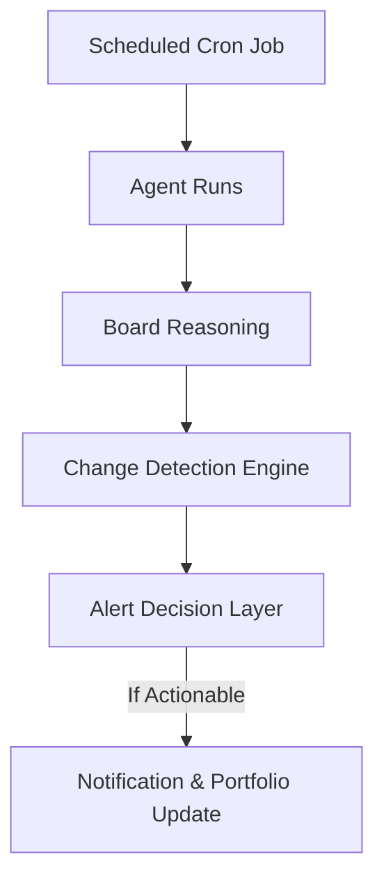

# Alerting, Portfolio & Deployment Layer (Master Specification)

**System Role**: Principal Product Architect + Institutional Investor Platform Designer  
**Core Purpose**: Ensure the system runs continuously and alerts **only** when it matters.

---

## 1. Core Question
*"When should a human be interrupted?"*

Not: *"What is happening?"*  
But: *"Is this change important enough to act on?"*

---

## 2. Design Philosophy
### ✅ This Layer IS:
*   **Action-Oriented**: Alerts drive decisions, not just awareness.
*   **Quiet**: The system watches silently 99% of the time.
*   **Scalable**: Supports N companies (Portfolio View).
*   **Production-Ready**: Cron-driven, stateless, resilient.

### ❌ This Layer is NOT:
*   SPAM (No daily "everything is fine" emails).
*   Raw Analytics (No "GitHub activity up 2%" alerts).
*   Predictive (No "Revenue might drop" guesses).

---

## 3. High-Level System Flow


---

## 4. Change Detection Logic (Non-Negotiable)
**Rule**: Never alert on a snapshot. Always alert on **direction**.

### Valid Triggers
1.  **Risk Level Jump**: `Low` → `Medium` → `High` → `Critical`.
2.  **Risk Type Pivot**: `Execution` → `Product` (Fundamental shift in thesis).
3.  **Confidence Collapse**: High confidence → Low confidence (Uncertainty spike).
4.  **Persistent Deterioration**: 3 cycles of negative trend.

### Invalid Triggers
*   One-off deviation.
*   Single agent panic (unless it swings the Board).
*   Minor confidence flutters (+/- 5%).

---

## 5. Alert Severity Model
| Severity | Condition | Action |
| :--- | :--- | :--- |
| **INFO** | Minor context change | Log only (Passive) |
| **WARNING** | Risk Level increase (e.g., Low->Med) | Weekly Digest / Badge |
| **CRITICAL** | Risk Level jump (e.g., Med->Crit) or Death Spiral | **Immediate Push/Email** |

---

## 6. Alert Output Format
Human-readable JSON, ready for Slack/Email/UI.

```json
{
  "alert_type": "CRITICAL",
  "company": "Couchbase",
  "reason": "Execution and product signals deteriorated simultaneously",
  "supporting_agents": ["CTO", "CPO"],
  "timestamp": "2024-06-15T14:30:00Z",
  "previous_risk": "Medium",
  "new_risk": "Critical"
}
```

---

## 7. Portfolio Mode (Multi-Company View)
**User Goal**: *"Where should I spend attention today?"*

### Architecture
*   **Company Registry**: `backend/portfolio/companies.json` (List of monitored entities).
*   **Portfolio State**: `backend/db/portfolio_state.json` (Last known state for each).

### Dashboard View columns
1.  **Company Name** (e.g., Couchbase)
2.  **Current Risk** (Badge: Critical)
3.  **Change Indicator** (Arrow: ⬆️ ⬇️ ➡️)
4.  **Last Alert** (Time ago)
5.  **Confidence**

**Sorting**: Critical Risks → Recent Changes → Low Confidence.

---

## 8. Backend Architecture
```text
backend/
├── scheduler/
│   └── cron_runner.py       # The heartbeat
├── alerts/
│   ├── change_detector.py   # Compare Now vs Last_Run
│   ├── alert_rules.py       # Severity Logic
│   └── notifier.py          # Format & Send
└── portfolio/
    └── manager.py           # Registry & Aggregation
```

---

## 9. Implementation Plan
1.  **Portfolio Manager**: Define the list of companies (Currently just 1, but built for N).
2.  **Change Detector**: Implement logic to compare `current_verdict` vs `history[0]`.
3.  **Notifier**: Simple print/log for V1, extensible to Email/Slack.
4.  **Cron**: A script that runs the full pipeline for all portfolio companies.

---

## 10. Safeguards
*   **Deduplication**: Do not send the same alert twice if the state hasn't changed further.
*   **Resilience**: If one company fails to scrape, the pipeline continues for others.
*   **Rate Limits**: Max 1 Critical alert per 24h per company (unless new crisis).

---

## 11. Final Product Principle
*"The best intelligence systems are quiet — until they must speak."*
This layer decides when to speak.
