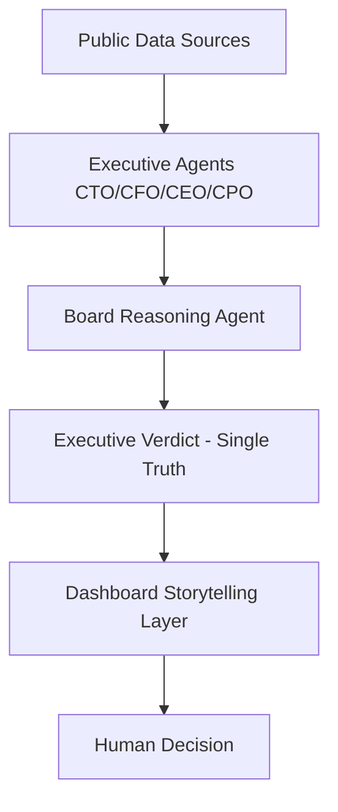

# Executive Intelligence Interface (Master Specification)

**Status**: Version 1.0  
**Role**: Investor UX Strategist & Principal Product Designer  
**Philosophy**: Clarity > Data Density  

---

## 1. Core Purpose
The **Dashboard & Storytelling Layer** is the single interface through which investors, founders, and oversight bodies judge the risk posture of an organization in **<30 seconds**.

**The Core Question**:  
*"What is the current risk posture of this company, and why should I care right now?"*

If the dashboard requires analysis to answer this, it has failed. It must deliver a **verdict**, not just data.

---

## 2. Design Philosophy
### ❌ What this is NOT
- A metrics dashboard
- A data explorer / BI tool
- A GitHub analytics page
- A "noisy" notification center

### ✅ What this IS
- A private board briefing
- A decision surface
- A confidence-building layer
- **Dark, Calm, Elite**

**Mental Model**:  
The user skims **Top → Middle → Bottom**. They trust **Language + Structure** more than charts.  
Therefore: **Hierarchy > Density**.

---

## 3. End-to-End System Flow

*The dashboard never shows raw data by default. It shows decisions and explanations.*

---

## 4. Information Architecture (Top-Down)

### SECTION 1: Executive Risk Hero (The Anchor)
**Purpose**: Immediate situational awareness.  
**Components**:
- **Overall Risk Badge**: `Low` | `Medium` | `High` | `Critical`
- **Visuals**: Color-coded (Green/Yellow/Orange/Neon Red). Subtle pulse only on state change.
- **Context**: "Updated X hours ago".

### SECTION 2: Board Summary (The Narrative)
**Purpose**: The "Why". Replaces the need to read raw logs.  
**Content**: A 3-4 line paragraph generated by the Board Agent.  
**Tone**: Calm, factual, authoritative. No drama.  
*Example: "Execution signals are weakening while product adoption shows early decline. Financial posture remains stable, but narrative optimism is increasingly misaligned with operational reality."*

### SECTION 3: Executive Agent Cards (The Proof)
**Purpose**: Sector-specific signals.  
**Structure**: 4 Cards (Equal Authority).
1.  **CTO** (Engineering Execution)
2.  **CFO** (Financial Reality)
3.  **CEO** (Strategic Narrative)
4.  **CPO** (Product/Market Reality)

**Content per Card**:
- **Status**: `Healthy` | `Stressed` | `Declining`
- **Explanation**: One-line summary (e.g., "High technical debt, low velocity").
- **Constraints**: **NO RAW METRICS**. No charts inside cards.

### SECTION 4: Time-Based Risk Timeline (The Trend)
**Purpose**: Proves the system reasons over time. Avoids snapshot bias.  
**Visual**: Simple trend line. Hover for explanation of past verdicts.

---

## 5. Visual Design System
**Theme**: "Dark, Calm, Elite" (Fintech Terminal / Military Ops).

| Element | Style Rule |
| :--- | :--- |
| **Background** | Near-black / Deep Navy (`#030507`) |
| **Typography** | Monospace for Data (`JetBrains Mono`), Sans for Text (`Inter`). |
| **Accent** | Restrained Neon (Cyan `#00f2fe` or Purple). |
| **Surface** | Glassmorphism (Blur 20px, Opacity 0.6). |
| **Motion** | Implies confidence. No looping animations. Fade/Slide only. |

---

## 6. Data Contract (Backend → Frontend)
The dashboard consumes a **SINGLE** endpoint: `GET /api/board/status`

```json
{
  "overall_risk": "High",
  "board_summary": "Execution does not match the CEO's narrative.",
  "confidence": 0.85,
  "timestamp": "2024-05-20T10:00:00Z",
  "agents": {
    "CTO": { "health": "Stressed", "explanation": "Declining Velocity" },
    "CFO": { "mode": "Stable", "explanation": "Hiring freezes detected" },
    "CEO": { "health": "Optimistic", "explanation": "Press releaes positive" },
    "CPO": { "health": "Declining", "explanation": "User churn increasing" }
  },
  "risk_timeline": [
    { "date": "2024-05-19", "risk": "Medium" },
    { "date": "2024-05-18", "risk": "Low" }
  ]
}
```

---

## 7. Storytelling Rules (Non-Negotiable)
1.  **Never overwhelm.**
2.  **Never contradict** the Board Verdict.
3.  **Never expose internal logic** (vector distances, thresholds) to the executive view.
4.  **Never show confidence without explanation.**

*"If everything is important, nothing is."*
