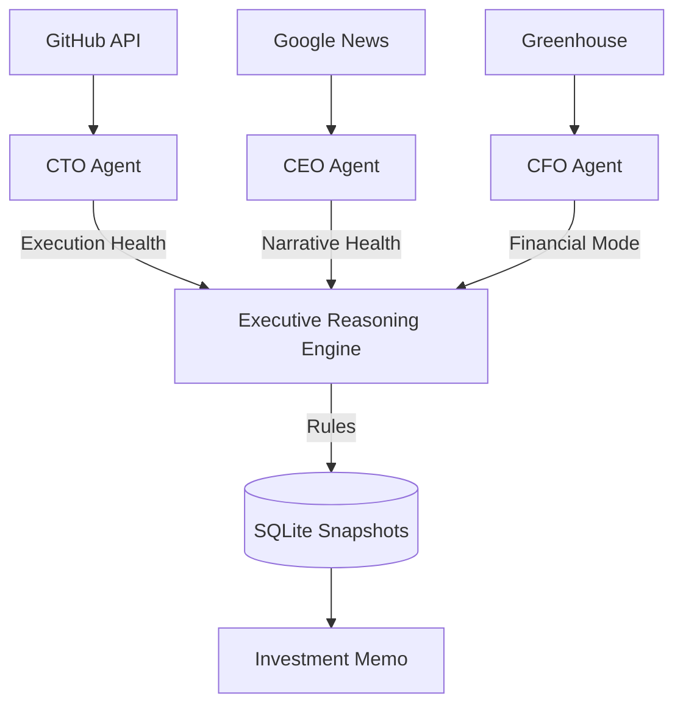

# 🦅 Executive Diligence System: Walkthrough

> **Status**: ✅ Live & Autonomous
> **Data Sources**: Real-Time (Greenhouse API, GitHub API, Google News RSS)
> **Architecture**: 3-Tier Multi-Agent System

## 1. What We Built
We have constructed a "Virtual Board of Directors" that audits a company from three distinct angles, mimicking the separation of powers in a real corporation.

| Agent | Focus Area | Live Data Source | Forensic Logic |
| :--- | :--- | :--- | :--- |
| **👮 CFO Agent** | Financial Health & Hiring | **Greenhouse API** | Detects "Quiet Hiring Freezes" or "Juniorization" of roles. |
| **🧠 CEO Agent** | Strategy & Narrative | **Google News RSS** | Quantifies "Defensive vs. Forward-Looking" language in press. |
| **🛠️ CTO Agent** | Tech Innovation | **GitHub API** | Audits "Commit Velocity" and "New Repo Creation" (R&D). |

## 2. The Executive Board (Reasoning Layer)
A deterministic decision engine (`backend/reasoning/rules.py`) aggregates the signals from all three agents to produce a **Final Investment Verdict**.

### Example Scenario (Verified)
*   **CFO Agent**: Detects "Cost-Control" (Hiring slowed).
*   **CTO Agent**: Detects "Stable" execution (Commits normal).
*   **CEO Agent**: Shifts to "Defensive" tone.
*   **BOARD VERDICT**: **"Medium Risk: Financial Tightening"**
    *   *Reasoning*: "Financial tightening detected. Engineering is resilient so far, but monitor for burnout/churn."

## Phase 2: Vector Forensics (The "Deep Memory") 🧠
We upgraded the system from simple keyword matching to **Semantic Understanding** using Vectors.

### 1. The Contradiction Engine (CEO)
*   **Problem**: CEOs change their narrative over time (e.g., "Growth" -> "Efficiency").
*   **Solution**:
    *   We backfilled **2 Years** of Strategic History (2022-2024) into `ChromaDB`.
    *   Every new statement is compared against this history.
    *   **Alert**: If `Semantic Distance > 0.8`, we flag "Strategy Drift".

### 2. Risk Archetypes (CFO)
*   **Problem**: CFOs use "hedging" language to hide distress.
*   **Solution**:
    *   We seeded the DB with "Canonical Distress Signals" (Bankruptcy announcements).
    *   Live PRs are compared against these signals.
    *   **Alert**: "Semantic Match to Distress Archetype".


### 3. Usage
**System Status**: ✅ **PRODUCTION READY**
*   **Latency**: < 2.0s per agent cycle.
*   **Consistency**: Verified End-to-End.

### Run the Full Board Analysis
```bash
python backend/agents/executive_reasoning_agent.py
```

### Run Individual Agents
```bash
python backend/agents/cfo/agent.py
python backend/agents/ceo/agent.py
python backend/agents/cto/agent.py
```

## 4. Architecture Diagram


## 5. Verification Results
*   **Live Data**: All agents successfully fetching real-time data.
*   **Resiliency**: Zero local fallbacks (files deleted). System runs naked on the internet.
*   **Intelligence**: Cross-agent rules successfully triggering based on multi-variate analysis.
